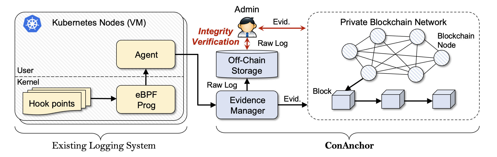

# ConAnchor eBPF

[English README](./README.md)

ConAnchor는 컨테이너 환경을 위한 런타임 보안 로그 무결성 검증 시스템입니다. 현재 시스템은 간단한 eBPF 프로그램을 활용해서 로그를 수집하도록 설계되었지만, 최종 목표로는 Falco나 Tetragon과 같은 실제 CNCF 툴과 연계해서 로그의 무결성을 보장하는 것을 목표로하고 있습니다.

이 프로젝트의 핵심은 로그의 변조를 감지할 수 있는 증거를 만드는 것입니다. 이를 블록체인에 저장하고, 이후 수정, 삭제 등의 훼손 여부를 검증하는 기능을 제공합니다.

## Architecture



## Build & Usage

### 요구사항

- `/sys/kernel/btf/vmlinux`에 BTF가 제공되는 Linux 환경
- BPF LSM을 지원하는 kernel
- `clang`, `bpftool`, `make`, Go
- BPF LSM 프로그램 attach를 위한 root 권한 또는 충분한 capability

### Build

BPF binding 생성:

```sh
make generate
```

collector build:

```sh
make build
```

### Collector 실행

기본 local mock ledger 설정으로 실행:

```sh
sudo ./bin/collector
```

또는:

```sh
make run
```

특정 컨테이너 cgroup만 모니터링:

```sh
sudo ./bin/collector -target-cgroup-id 123456789
```

여러 cgroup ID는 comma로 구분합니다.

```sh
sudo ./bin/collector -target-cgroup-id 123456789,987654321
```

동일한 값은 `CONANCHOR_TARGET_CGROUP_ID`로도 설정할 수 있습니다. target이 설정되지 않으면 collector는 모든 cgroup을 모니터링합니다.

### Runtime Event Coverage

현재 collector는 다음 이벤트를 관찰합니다.

- `bprm_check_security`: `wget` 실행 감지
- `file_open`: `/var/run/secrets/`, `/run/secrets/` 아래 Kubernetes service-account secret path 접근 감지
- `sb_mount`: `/proc`, `/sys`, `/host`, `/mnt`, `/var/run`, `proc`, `sysfs`, `cgroup`, `cgroup2`, `overlay` 등과 관련된 의심스러운 mount 시도 감지

### 출력 예시

```json
{"timestamp_ns":1710000000000000000,"event_type":"exec","pid":1234,"tgid":1234,"uid":0,"gid":0,"comm":"wget","path":"/usr/bin/wget","extra":"","flags":0,"retval":0,"cgroup_id":"123456789","container_id":"cri-containerd-abc123","container_instance_id":"cri-containerd-abc123","risk":"high","policy":"wget-exec"}
```

트리거 예시:

```sh
wget http://example.com/test
cat /var/run/secrets/kubernetes.io/serviceaccount/token
mount -t proc proc /somewhere
```

### 저장 데이터

원본 로그는 오프체인에 저장됩니다.

```text
data/logs/<container_instance_id>.jsonl
```

Batch metadata는 오프체인에 저장됩니다.

```text
data/batches/<container_instance_id>/batch_<batch_id>.json
```

Mock ledger는 anchor record를 저장합니다.

```text
data/ledger/mock_chain.jsonl
```

### Collector Integrity Options

```sh
sudo ./bin/collector \
  --data-dir ./data \
  --batch-size 10 \
  --collector-id collector-1
```

collector는 event JSONL을 stdout으로 출력하고, 원본 로그를 저장하며, batch를 finalize한 뒤 batch commitment를 anchor합니다. `SIGINT` 또는 `SIGTERM`을 받으면 partial batch를 flush합니다.

발표나 demo workflow를 위해 사람이 읽기 쉬운 진행 로그를 켤 수 있습니다.

```sh
sudo ./bin/collector \
  --data-dir ./data \
  --batch-size 10 \
  --collector-id collector-1 \
  --workflow-log
```

### Anchor된 로그 검증

```sh
go run ./cmd/verifier \
  --data-dir ./data \
  --container-instance-id demo-container \
  --from-batch 1 \
  --to-batch 3
```

변조되지 않은 경우 `status: "OK"`를 반환합니다. 변조가 있으면 `status: "FAILED"`와 함께 `MERKLE_ROOT_MISMATCH`, `EVENT_COUNT_MISMATCH`, `SEQUENCE_GAP`, `BATCH_HASH_MISMATCH`, `LEDGER_CHAIN_INVALID` 같은 failure type을 반환합니다.

### Demo Attack Simulation

eBPF 없이 synthetic log 생성:

```sh
make demo-generate
make demo-verify
```

공격 simulation:

```sh
make demo-attack-modify
make demo-attack-delete
make demo-attack-insert
make demo-attack-reorder
make demo-attack-rollback
```

예시 workflow:

```sh
make demo-generate
make demo-verify
make demo-attack-modify
make demo-verify
```

첫 검증은 `OK`, 공격 이후 검증은 `FAILED`가 되어야 합니다.

### Besu Ledger Backend

ConAnchor는 local mock ledger 대신 Hyperledger Besu를 사용할 수 있습니다. 원본 로그는 `data/logs` 아래 오프체인에 유지되며, Besu에는 `contracts/AnchorRegistry.sol`을 통해 anchor commitment만 저장됩니다.

Local Besu dev node 실행:

```sh
./scripts/besu/start_besu_dev.sh ./data/besu-node-1 8545 8546 30303 conanchor-besu-node-1
```

Anchor contract compile 및 deploy:

```sh
export BESU_RPC_URL=http://127.0.0.1:8545
export BESU_PRIVATE_KEY=<funded-private-key>
./scripts/besu/deploy_anchor_registry.sh
```

Besu anchoring으로 collector 실행:

```sh
sudo CONANCHOR_BESU_PRIVATE_KEY=$BESU_PRIVATE_KEY ./bin/collector \
  --ledger-backend besu \
  --besu-rpc-url http://127.0.0.1:8545 \
  --besu-chain-id 0 \
  --besu-contract-address <AnchorRegistry-address> \
  --target-cgroup-id 49396 \
  --data-dir ./data \
  --batch-size 1 \
  --collector-id collector-1 \
  --workflow-log
```

Besu anchor 기준 검증:

```sh
LEDGER_BACKEND=besu \
BESU_RPC_URL=http://127.0.0.1:8545 \
BESU_CONTRACT_ADDRESS=<AnchorRegistry-address> \
./scripts/verify_with_ledger.sh ./data <container_instance_id> 1 0
```
